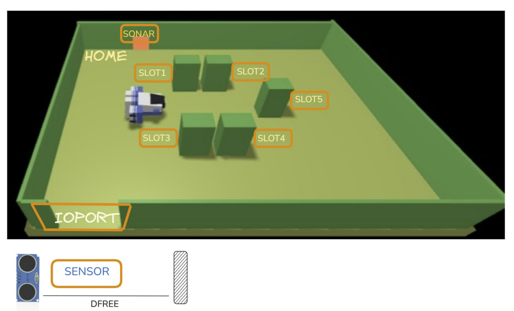

+++
title = "sprint0"
+++

# 1. Introduzione

Una compagnia di navigazione per il trasporto marittimo di merci, ( **azienda**), intende automatizzare le operazioni di carico dei
container nella **stiva** della nave
A tal fine, la compagnia prevede di impiegare un robot a trazione differenziale, denominato **cargorobot**.  

La **hold** è un’area rettangolare e piana dotata di una porta di ingresso/uscita (IOPort). L’area dispone di 4 slot per lo stoccaggio dei container e di uno slot denominato slot5.

Nell’immagine sopra:
- Gli **slot 1-4** rappresentano le aree di stoccaggio riservate al deposito di un _container_ ciascuno.
- Lo **slot 5** rappresenta un’area in cui il _cargorobot_ deve stoccare temporaneamente un _container_ prima di collocarlo in uno degli _slot 1-4_.  
    Durante lo stoccaggio temporaneo, un dispositivo 'marker' etichetta il container con un codice a barre identificativo e
segnala quando tale operazione di marcatura è completata.
- L' **IOPort** è un dispositivo dotato di un **pulsante** e di un **display**.  
    - Il _pulsante_ viene premuto dal cliente per inviare una richiesta di carico di un container sul cargorobot.
    - Il _display_ serve a mostrare la risposta alla richiesta e lo stato attuale della stiva.
- Il **sensore** associato all’IOPort è un dispositivo (un _sonar_) utilizzato per rilevare la presenza di un container, quando
misura una distanza $D$ tale che $D \lt \frac{DFREE}{2}$, per un tempo ragionevole (e.g. 3 secondi).

# 2. Requisiti

L' **azienda** ci ha chiesto di realizzare un servizio denominato **cargoservice** che deve funzionare come segue.  
**Cargoservice** è in grado di ricevere una richiesta di carico di un container inviata da un cliente tramite il _pulsante_ del _IOPort_.

- Invia la risposta `retrylater` se l’IOPort è attualmente occupato da un container o se il sistema è fuori servizio.
- Rifiuta la richiesta quando l’area di stoccaggio è già piena, i.e. gli `slot 1-4` sono già occupati.
- In caso contrario, considera il sistema come **engaged**, individua uno slot libero e restituisce come risposta il nome di tale slot riservato.  
    Mentre è _engaged_, il sistema deve far lampeggiare un LED.

Quando la _richiesta di carico_ viene accettata, il cliente deve spostare il contenitore nell’area del _sensore sonar_ entro un tempo prestabilito (e.g. 30 secondi), altrimenti il sistema diventa **disengaged**.
Successivamente, il _cargo service_ utilizza il _cargorobot_ per spostare il contenitore dal _IOPort_ allo _slot 5_ (per la marcatura del contenitore) e poi allo slot riservato.

Il servizio deve inoltre visualizzare sul display dell’IOPort:

- lo stato attuale della **stiva**
- il messaggio **'service working'**, quando tutto procede correttamente
- il messaggio **'out of service'** se il _sensore sonar_ rileva una distanza $D \gt DFREE$ per almeno 3 secondi (forse a causa di un guasto del _sonar_).

# 3. Analisi dei Requisiti

